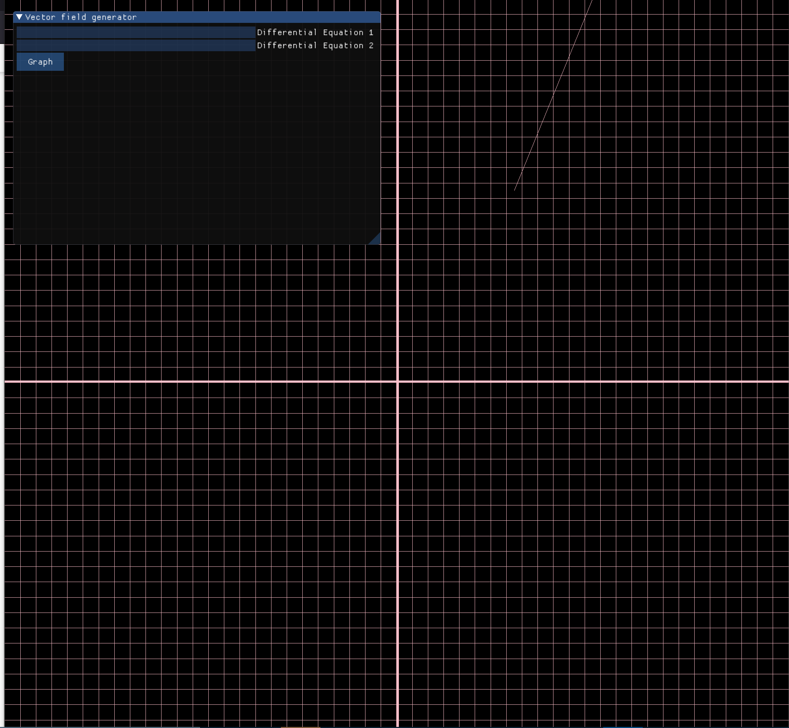

My latest personal project! This program uses C++ with OpenGL for graphics modelling. This is my first time using OpenGL.

So far all this program does is construct a graph. The ultimate goal is to make something like this: https://homepages.bluffton.edu/~nesterd/apps/slopefields.html, where a user can enter two differential equations, have the cooresponding vector field appear, and then have the ability to click anywhere for solution curves to appear. 

This will require a mathematical parser to plug in many values for x and y and provide outputs, then making these outputs into vectors and plotting them, and a lot more knowledge about OpenGL than I have now.

Right now I am working on figuring out a math parser.

This is the current output of the program as of 3/27/2021:

