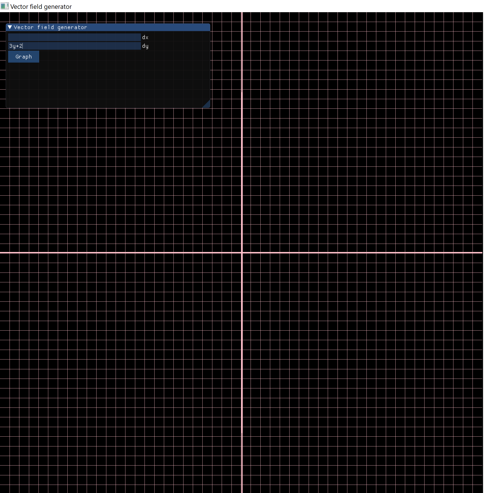

Work in progress.

This uses a mathematical parser called Exprtk, the parser interprets the equations so they can be used beyond being just a string of numbers and letters (so you can plug in values, etc). Computation is via plugging in many values for x and y and provide outputs, then making these outputs into vectors and plotting them. For this I use Eulers method to get points to plot. User interface comes from a library called ImGui. Uses OpenGL with C++ for rendering graphics directly from the GPU.

